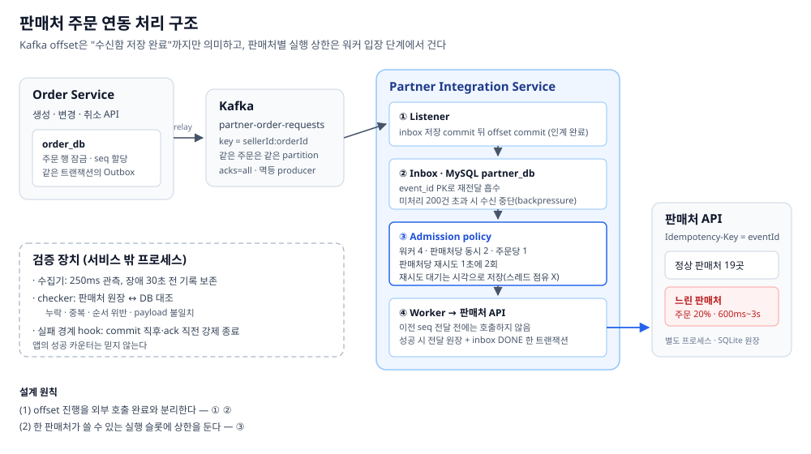
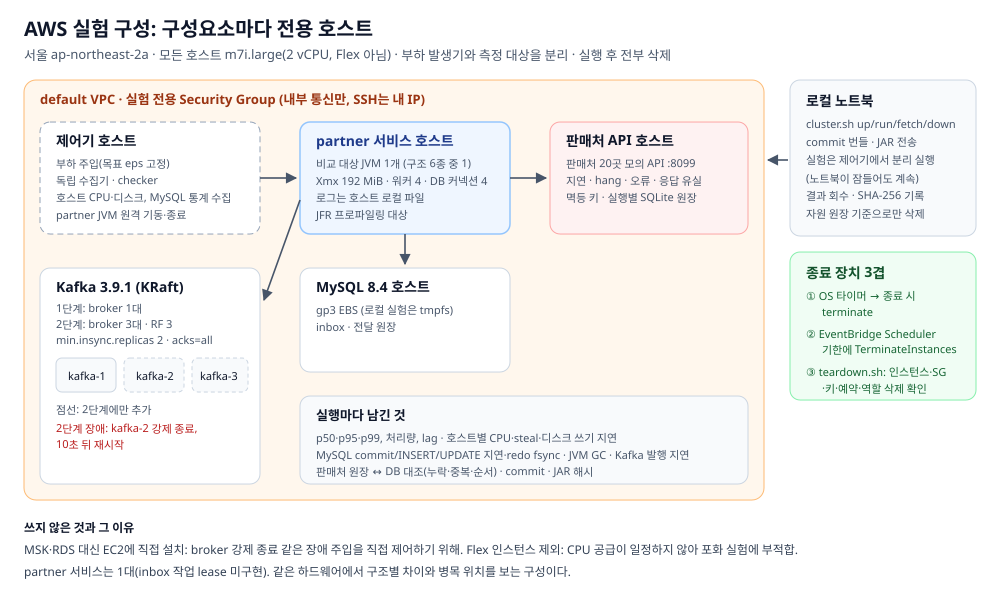

# 판매처 주문 연동 격리 실험

주문 이벤트를 각 판매처의 주문 접수 API로 전달하는 Kafka 기반 연동 서비스와, 그 처리 구조를 같은 조건에서 비교하는 실험 장치입니다.

한 판매처의 API가 느려지거나 멈출 때, 같은 Kafka partition을 쓰는 다른 판매처의 주문 전달까지 늦어지는 문제를 다룹니다. 같은 주문의 생성 → 변경 → 취소 순서와 "판매처에 한 번만 반영"을 지키면서, 정상 판매처의 지연을 막는 구조를 찾는 것이 목적입니다.



## 구성

| 모듈 | 역할 |
| --- | --- |
| `order-service` | 주문 생성·변경·취소 API. 주문 저장과 이벤트를 같은 트랜잭션의 Outbox로 남기고 relay가 발행 |
| `inventory-service` | 재고 차감과 결과 Outbox |
| `notification-service` | 주문 결과 알림. 실시간 알림과 대량 알림을 다른 lane으로 나눠 처리 |
| `partner-integration-service` | 판매처 주문 이벤트를 받아 판매처 API로 전달. 처리 구조를 설정으로 바꿀 수 있음 |
| `experiments/` | 실험 제어기, 모의 판매처 API, 장애 주입, 독립 수집기, checker, 보고서 |
| `experiments/aws/` | 구성요소마다 전용 호스트를 두는 AWS 실험 클러스터 |

## 처리 구조

`partner-integration-service`는 `PARTNER_MODE`(실험 장치에서는 `--mode`)로 처리 구조를 고릅니다. 모든 구조가 같은 순서 확인, 같은 멱등 키, 같은 자원 예산(워커 4, DB 커넥션 4)을 씁니다.

| 모드 | 동작 |
| --- | --- |
| `sequential` | listener가 판매처 API를 호출하고, 업무 commit 뒤 offset을 commit |
| `async` | Spring Kafka `asyncAcks`. 워커가 순서와 무관하게 끝내고 각자 ack |
| `circuit-breaker` | 순차 처리 + 판매처별 서킷브레이커(Resilience4j). 실패한 메시지는 제자리에서 재시도 |
| `retry-topic` | 서킷이 열린 판매처의 메시지를 retry topic으로 옮겨 본 partition을 비움 |
| `parallel-consumer` | Confluent Parallel Consumer, key 단위 순서·병렬 처리(라이브러리 기본 설정) |
| `inbox` | 메시지를 DB inbox에 저장한 뒤 offset commit, 워커가 판매처별 실행 상한 안에서 전달 |
| `inbox-batch` | `inbox`와 같되 poll 단위로 묶어 한 트랜잭션에 저장 |

## inbox 구조

- **수신:** Kafka 메시지를 inbox 테이블에 저장하고 commit한 뒤 offset을 commit합니다. offset commit은 "판매처 전달 완료"가 아니라 "수신함 저장 완료"를 뜻합니다. 재전달된 메시지는 `event_id` 기본 키가 걸러 냅니다.
- **입장 심사:** 워커가 작업을 시작하기 전에 전체 워커 수, 판매처당 동시 실행(2), 주문당 동시 실행(1), 판매처당 재시도 예산(초당 2회)을 확인합니다. 재시도 대기는 스레드를 잡아 두지 않고 다음 시도 시각으로 저장합니다.
- **순서:** 각 주문의 다음 순번만 꺼내고, 판매처 호출 전과 결과 저장 때 앞 순번 전달 여부를 확인합니다. `UNIQUE(seller_id, order_id, seq)`가 마지막 방어선입니다.
- **한 번만 반영:** 판매처 요청에 `Idempotency-Key: eventId`를 보냅니다. 전달 원장과 inbox 완료 표시는 같은 트랜잭션에 기록합니다.
- **용량:** 미처리 행이 한도(기본 200)를 넘으면 수신을 멈춥니다. 완료 행은 보존 기간(기본 60초)이 지나면 지웁니다.

## 실험 장치

- **워크로드:** 판매처 2곳(`pair`), 판매처 20곳에 큰 판매처 하나가 주문 20%(`market`), 목표 처리량을 정한 입력(`sweep`)
- **장애 주입:** 판매처 지연·hang·오류·응답 유실, 공용 DB 커넥션 점유, broker 강제 종료, 프로세스 강제 종료(DB commit 직후, ack 직전, broker ack 직후 Outbox `SENT` 저장 전, retry topic 발행 직후 등)
- **정합성 판정:** 서비스 밖의 checker가 판매처 원장(별도 프로세스의 SQLite)과 MySQL을 대조해 누락·중복·순서 위반·payload 불일치를 셉니다. 앱의 성공 카운터는 쓰지 않습니다.
- **기록:** 실행마다 manifest(commit, JAR 해시, 설정), 지연 분포, lag, JVM GC, Kafka 발행 지연, MySQL 문장별 지연과 redo fsync, 호스트별 CPU·디스크 쓰기 지연을 남깁니다.
- **AWS:** `experiments/aws/cluster.sh`가 Kafka(1대 또는 3대), MySQL, partner 서비스, 모의 판매처 API, 제어기를 각각 다른 EC2에 띄웁니다. 각 호스트는 OS 타이머와 EventBridge 예약으로 기한이 지나면 스스로 종료되고, `down`은 생성 기록에 있는 자원만 지웁니다.



## 실행

Docker, Java 17 이상, Python 3가 필요합니다.

```bash
./gradlew test bootJar
docker compose -p partner-isolation -f docker-compose.experiment.yml up -d --wait

# 한 번 실행: 판매처 20곳, partition 4, inbox, 판매처 600ms 지연
python3 experiments/run.py --mode inbox --scenario api --workload market --partitions 4

# 처리량: 초당 320건을 12초 동안, 장애 없음
python3 experiments/run.py --mode inbox-batch --scenario clean --workload sweep --partitions 4 --rate 320

# 전체 비교와 실패 경계 검증 (약 1시간 30분)
bash experiments/reproduce.sh
```

AWS 클러스터:

```bash
bash experiments/aws/cluster.sh up <결과 폴더> 1     # broker 1대(3이면 RF 3, min ISR 2)
bash experiments/aws/cluster.sh run <결과 폴더> 1    # 제어기에서 단계별 실험 시작
bash experiments/aws/cluster.sh status <결과 폴더>
bash experiments/aws/cluster.sh fetch <결과 폴더>    # 결과 회수와 체크섬
bash experiments/aws/cluster.sh down <결과 폴더>     # 생성한 자원만 삭제
```

실행 결과는 Git에 올리지 않는 `experiment-evidence/` 아래에 실행별 폴더로 남고, `experiments/comparison_report.py`와 `experiments/sweep_report.py`가 요약을 만듭니다.

## 코드 지도

| 위치 | 역할 |
| --- | --- |
| `partner-integration-service/.../kafka` | Kafka 수신(레코드 단위·poll 단위), retry topic, Parallel Consumer 연결 |
| `.../inbox` | 수신함 저장, 대기 작업 조회, 완료 행 정리 |
| `.../dispatch` | 입장 심사(판매처별 실행 상한, 재시도 예산), 워커 |
| `.../processing` | 순서 확인, 판매처 API 호출, 전달 원장 기록, 서킷브레이커 |
| `.../experiment` | 실험 제어용 관측·입력 엔드포인트 |
| `experiments/run.py` | 단일 실행 제어기 (`--help`) |
| `experiments/topology.py` | 로컬/분산 환경의 호스트 설정 |

## 보장 범위

- partner 서비스는 한 인스턴스를 전제로 합니다. 여러 인스턴스 사이의 inbox 작업 소유권(lease)은 없습니다.
- 판매처 API가 멱등 키를 지원하지 않으면, 응답 유실 시 중복 반영 여부를 확정할 수 없습니다.
- 실험 입력은 partner JVM의 producer로 넣으므로 그 비용이 모든 구조에 똑같이 포함됩니다.

기존 주문·재고·알림 프로토타입은 `baseline-2026-10-06-d28e898` 태그에 보존되어 있습니다.
